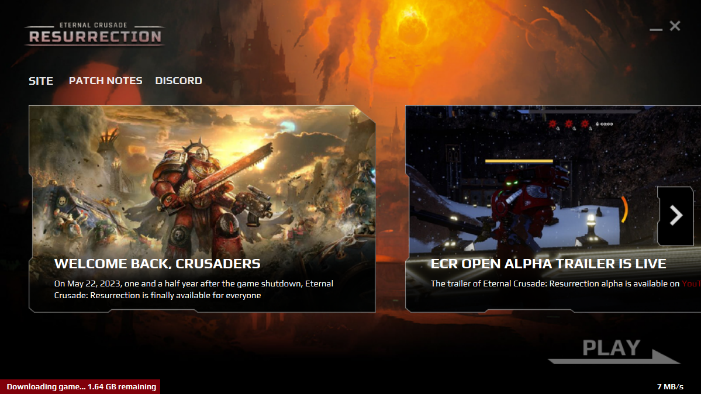
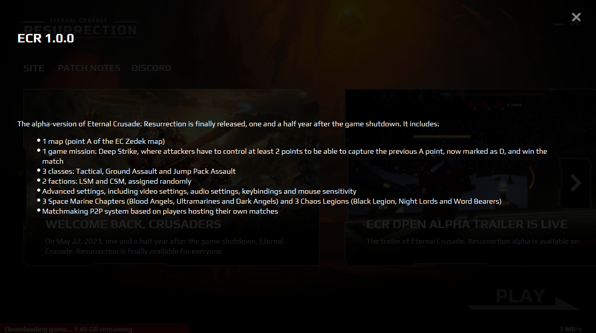

# ECR Launcher

Rather simple game launcher written in Python and PyQt6 which supports:

- Getting news (title, paragraph and image) from the server and displaying them with applying mask and frame onto 
image (see screenshots)
- Getting patch notes and displaying them in a separate "tab"
- Downloading full game, downloading patches, verifying game integrity
- Self updating (the launcher)
- Launching the game
- Optionally cross-platform

## Screenshots

### Main screen

### Patch notes

They will be with scrollbar if the text is large

## Build

### Launcher updater

`pyinstaller --onefile --icon=Source/Assets/update.ico Source/launcher_updater.py`

### Launcher

`pyinstaller --windowed --onefile --icon=Source/Assets/ECR_icon.ico Source/main.py`
